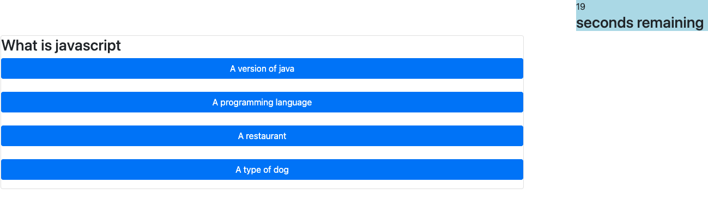

# Quiz Game

### Description
This is a web page that functions as a quiz app. 

### Features
* Questions can be changed via the json file in the repo
* Timing function if answer is incorrect it subtracts 5 seconds
* It will keep High score using the browsers localStorage function
* High scores can be cleared

### Deployment
This can be cloned using git and then run retaining the directory structure with the web server of your choice.

### JSON file notes
You can update the file with different questions. The functions in the program 
currently look for the structure to be the same as the current json file in the repository.

### Future feature roadmap
A future feature to pull from an API is planned.

A theme selector on the first page loaded

### Deployed Example
<https://philipbrowning.github.io/quiz-game/>

### Screenshots

